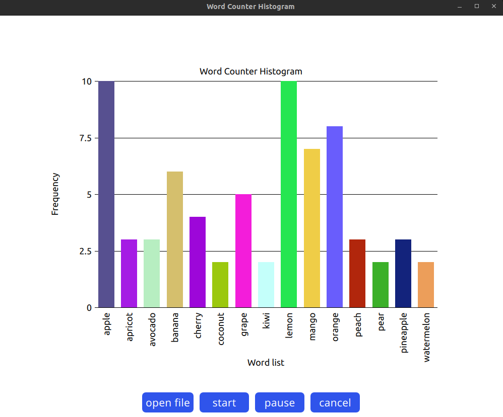

# Multithreaded chart qml

**Multithreaded chart qml** — это приложение для параллельного чтения текстового файла с поддержкой подсчета количества строк и отслеживания прогресса обработки. Приложение предоставляет функции для чтения файла, подсчета частоты слов, приостановки и отмены операций. Результат чтения отправляется на интерфейс пользователя (UI) для отображения актуального состояния.

## Функциональность

1. Старт, Пауза и Отмена чтения файла — поддержка управления операциями.
2. Отображение прогресса — процент обработки файла на основе прочитанных строк.
3. Подсчёт и отображение частоты слов — подсчёт частоты встречаемости каждого слова и передача информации о топ-15 словах в интерфейс.
4. Параллельное выполнение — приложение не блокирует основной поток, обеспечивая отзывчивость UI.

## Архитектура
### Основные классы и компоненты

- **FileProcessor** — основной класс, отвечающий за параллельное чтение файла, подсчет строк и частоты слов, а также обновление прогресса.
- **QFuture** и **QFutureWatcher** — используются для управления параллельными операциями, включая обработку начала, завершения и отмены задач.
- Сигнально-слотовая система Qt — используется для связи между **FileProcessor** и интерфейсом, отправки обновлений о прогрессе и передачи данных.

### Логика работы

1. **Инициализация**
- При создании объекта **FileProcessor** инициализируются необходимые сигналы и слоты, такие как **fileReading**, **fileProcessed**, **progressUpdated**, **pauseChanged**, **readStarted**, **readFinished** и **readingCanceled**.
- **QFutureWatcher** отслеживает начало, завершение и отмену параллельной задачи.

2. **Методы управления чтением**
- **start()**: Запускает процесс параллельного чтения файла, используя **QtConcurrent::run**, который создает отдельный поток для выполнения метода **readFile()**.
- **togglePaused()**: Приостанавливает или возобновляет процесс чтения, используя **QFutureWatcher::togglePaused()** и обновляет флаг **isPausedFlag**, отправляя сигнал **pauseChanged**.
- **cancel()**: Отменяет процесс чтения, вызывая **QFutureWatcher::cancel()**. Если чтение приостановлено, оно сначала возобновляется, после чего выполняется отмена.

3. **Метод** **readFile()**
- Подсчет строк: Метод **getLineCount()** сначала подсчитывает общее количество строк в файле, чтобы впоследствии рассчитать процент выполнения задачи.
- Чтение и обработка строк: Каждая строка читается по одной и разбивается на слова. Для каждого слова обновляется карта частоты **wordCountMap**.
- Обновление прогресса: После обработки каждой строки обновляется процент прочтения файла. Процент вычисляется как отношение прочитанных строк к общему количеству.
- Отправка данных: По мере обработки строки создается карта частоты слов и отбирается топ-15 самых частых слов, которая отправляется в UI с помощью сигнала **fileReading**.
- Задержка: Для наглядности добавляется небольшая задержка, чтобы показать прогресс в реальном времени.

4. **Подсчёт топ-15 слов** (**getTopWords()**)
- При помощи **getTopWords()** создается отсортированный список пар "слово-частота", который затем сокращается до топ-15 и отправляется в UI.

## Сигналы

1. **filePathChanged** — сигнализирует об изменении пути файла.
2. **fileProcessed** — отправляется после завершения чтения файла, передает полную карту wordCountMap.
3. **fileReading** — используется для отправки промежуточных результатов обработки файла, чтобы UI мог отображать прогресс.
4. **pauseChanged** — отправляет текущее состояние паузы в UI.
5. **readStarted** — сигнализирует о начале чтения файла.
6. **readFinished** — отправляется по завершению чтения.
7. **readingCanceled** — сигнализирует об отмене операции.
8. **progressUpdated** — отправляет текущий процент выполнения для отображения прогресса.

## Основные методы

1. **start()** — запускает параллельное чтение файла.
2. **togglePaused()** — приостанавливает или возобновляет операцию чтения.
3. **cancel()** — останавливает операцию чтения и сбрасывает результаты.
4. **getLineCount()** — подсчитывает общее количество строк в файле для расчета прогресса.
5. **readFile(const QString &filePath)** — основной метод чтения и обработки строк файла, считает частоту слов и отправляет прогресс в UI.
6. **getTopWords(const QVariantMap &wordCountMap, int topCount) const** — возвращает топ-15 слов с их частотой для UI.

## Требования
- **Qt 5.15** 
- **C++11** 
